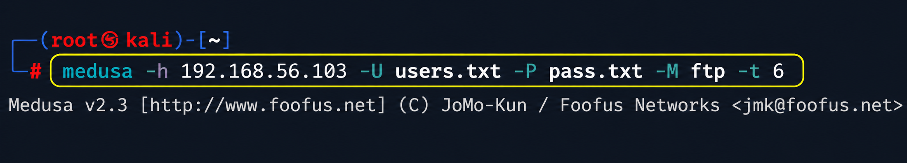

# Dictionary Attack: Exploiting Vulnerable FTP with Medusa


<p align="center">
  
  
  
  
  
  
</p>


> **Laboratório didático de Segurança da Informação** demonstrando, em ambiente isolado e autorizado, como funciona um ataque de força bruta do tipo **Dictionary Attack** contra um serviço FTP vulnerável.

---

## 📌 Descrição do Projeto

Este repositório apresenta um laboratório prático desenvolvido como projeto pessoal para demonstrar conhecimentos em segurança ofensiva, enumeração de serviços e ataques de dicionário.
O objetivo foi demonstrar, de forma controlada, como um atacante pode utilizar listas de usuários e senhas para testar combinações contra um serviço exposto.

A demonstração foi realizada com:

- **Kali Linux** como máquina atacante;
- **Metasploitable 2** como máquina alvo vulnerável;
- **Nmap** para enumeração de portas e serviços;
- **Medusa** para execução do ataque de dicionário contra o serviço **FTP**.

---

## 🛠️ Ambiente e Ferramentas Utilizadas

### 🖥️ Ambiente

---

| Imagem | Recurso | Descrição |
|:---:|---|---|
|  | **Virtualização** | Oracle VirtualBox utilizado para criar, executar e isolar as máquinas virtuais do laboratório de forma segura. |
|  | **Máquina atacante** | Kali Linux utilizado como ambiente ofensivo para execução das ferramentas de enumeração, criação de wordlists e ataque. |
|  | **Máquina alvo** | Metasploitable 2 utilizado como sistema vulnerável propositalmente configurado para práticas de segurança em laboratório. |
|  | **Rede** | Rede virtual isolada entre as VMs, permitindo a comunicação entre atacante e alvo sem exposição externa. |
|  | **Serviço explorado** | Serviço FTP identificado durante a fase de enumeração e utilizado como ponto de análise no ataque de dicionário. |
|  | **Porta explorada** | Porta **21/tcp**, associada ao protocolo FTP, selecionada para demonstrar tentativas automatizadas de autenticação. |

### ⚙️ Ferramentas

---

| Imagem | Ferramenta | Finalidade |
|:---:|---|---|
|  | **Nmap** | Ferramenta utilizada para identificar portas abertas, serviços ativos e versões em execução no alvo Metasploitable 2. |
|  | **Medusa** | Ferramenta utilizada para automatizar testes de autenticação com usuários e senhas definidos em wordlists customizadas. |
|  | **Bash** | Shell utilizado para criar, organizar e manipular os arquivos de usuários e senhas empregados durante o laboratório. |
|  | **Pentest** | Abordagem prática aplicada para simular um teste de intrusão autorizado, controlado e focado em aprendizado técnico. |

---

## 🚀 Guia de Execução Passo a Passo

---

## 1. 🔎 Enumeração com Nmap

A primeira etapa do laboratório foi realizar o reconhecimento do alvo com o objetivo de identificar portas abertas, serviços ativos e versões em execução.

---

<table>
  <tr>
  </tr>
  <tr>
    <td width="100%" align="center">
      
    </td>
  </tr>
</table>

### 🧩 Explicação dos parâmetros

---

| Parâmetro | Função | Relevância no laboratório |
|---|---|---|
| `-sV` | Detecta as versões dos serviços encontrados durante a varredura. | Permite identificar tecnologias específicas em execução, como `vsftpd 2.3.4`, auxiliando na análise da superfície de ataque. |
| `-p` | Define manualmente quais portas serão analisadas pelo Nmap. | Direciona a enumeração para portas relevantes, tornando a varredura mais objetiva e alinhada ao escopo do laboratório. |
| `21,22,80,445,139` | Lista as portas selecionadas para a varredura. | Inclui serviços comuns como FTP, SSH, HTTP e SMB, permitindo comparar diferentes pontos de exposição no alvo. |
| `192.168.56.103` | Define o endereço IP da máquina alvo Metasploitable 2. | Representa o host vulnerável utilizado no ambiente controlado para a etapa de reconhecimento. |

### 📊 Resultado identificado

---

<table>
  <tr>
  </tr>
  <tr>
    <td width="100%" align="center">
      
    </td>
  </tr>
</table>

### 🧠 Análise da enumeração

---

O serviço escolhido para o laboratório foi o **FTP**, identificado na porta `21/tcp`.

<table width="100%">
  <tr>
    <th width="12%">Porta</th>
    <th width="13%">Serviço</th>
    <th width="25%">Versão</th>
    <th width="50%">Observação</th>
  </tr>
  <tr>
    <td><code>21/tcp</code></td>
    <td><strong>FTP</strong></td>
    <td><code>vsftpd 2.3.4</code></td>
    <td>Serviço selecionado para o teste de dicionário com Medusa.</td>
  </tr>
  <tr>
    <td><code>22/tcp</code></td>
    <td><strong>SSH</strong></td>
    <td><code>OpenSSH 4.7p1</code></td>
    <td>Serviço de acesso remoto identificado durante a enumeração.</td>
  </tr>
  <tr>
    <td><code>80/tcp</code></td>
    <td><strong>HTTP</strong></td>
    <td><code>Apache httpd 2.2.8</code></td>
    <td>Servidor web ativo no alvo, indicando exposição de aplicação HTTP.</td>
  </tr>
  <tr>
    <td><code>139/tcp</code></td>
    <td><strong>NetBIOS/SMB</strong></td>
    <td><code>Samba smbd 3.X - 4.X</code></td>
    <td>Serviço relacionado a compartilhamento e comunicação em redes Windows/Linux.</td>
  </tr>
  <tr>
    <td><code>445/tcp</code></td>
    <td><strong>SMB</strong></td>
    <td><code>Samba smbd 3.X - 4.X</code></td>
    <td>Serviço de compartilhamento de arquivos exposto na máquina alvo.</td>
  </tr>
</table>

> A enumeração é uma etapa crítica em testes de intrusão, pois permite entender quais superfícies de ataque estão expostas antes de qualquer tentativa de exploração.

---


## 2. 📚 Criação das Wordlists

Após identificar o serviço FTP, foram criadas duas listas simples para fins didáticos:

- uma lista contendo possíveis **usuários**;
- uma lista contendo possíveis **senhas**.

---

<table>
  <tr>
  </tr>
  <tr>
    <td width="100%" align="center">
      
    </td>
  </tr>
</table>

### 📁 Estrutura dos arquivos

#### `users.txt`

```text
user
msfadmin
admin
root
````

#### `pass.txt`

```text
123456
password
qwerty
msfadmin
```

### 📝 Observação técnica

O operador `>` foi utilizado para redirecionar a saída do comando `echo` para arquivos `.txt`.

---

<table width="100%">
  <tr>
    <th width="18%">Arquivo</th>
    <th width="32%">Conteúdo</th>
    <th width="50%">Função</th>
  </tr>
  <tr>
    <td><code>users.txt</code></td>
    <td>Possíveis nomes de usuário</td>
    <td>Lista utilizada pelo Medusa com o parâmetro <code>-U</code> para testar usuários durante o ataque de dicionário.</td>
  </tr>
  <tr>
    <td><code>pass.txt</code></td>
    <td>Possíveis senhas</td>
    <td>Lista utilizada pelo Medusa com o parâmetro <code>-P</code> para testar senhas associadas aos usuários informados.</td>
  </tr>
</table>

> Em um ambiente real de defesa, listas de senhas comuns como `123456`, `password` e `qwerty` devem ser bloqueadas por políticas de senha.

---

## 3. ⚡ Ataque de Dicionário com Medusa

Com o serviço FTP identificado e as wordlists criadas, foi executado o ataque de dicionário utilizando o **Medusa**.

---

<table>
  <tr>
  </tr>
  <tr>
    <td width="100%" align="center">
      
    </td>
  </tr>
</table>

### 🧩 Explicação dos parâmetros

---

<table width="100%">
  <tr>
    <th width="20%">Parâmetro</th>
    <th width="35%">Função</th>
    <th width="45%">Relevância no laboratório</th>
  </tr>
  <tr>
    <td style="white-space: nowrap;"><code>-h 192.168.56.103</code></td>
    <td>Define o host alvo que será testado pela ferramenta.</td>
    <td>Direciona o ataque para a máquina Metasploitable 2 identificada previamente na etapa de enumeração.</td>
  </tr>
  <tr>
    <td style="white-space: nowrap;"><code>-U users.txt</code></td>
    <td>Define o arquivo contendo a lista de usuários.</td>
    <td>Permite que o Medusa teste os nomes de usuário criados na wordlist customizada do laboratório.</td>
  </tr>
  <tr>
    <td style="white-space: nowrap;"><code>-P pass.txt</code></td>
    <td>Define o arquivo contendo a lista de senhas.</td>
    <td>Permite testar combinações de senhas comuns contra os usuários definidos no arquivo <code>users.txt</code>.</td>
  </tr>
  <tr>
    <td style="white-space: nowrap;"><code>-M ftp</code></td>
    <td>Define o módulo/protocolo utilizado no ataque.</td>
    <td>Especifica que o teste será realizado contra o serviço FTP exposto na porta <code>21/tcp</code>.</td>
  </tr>
  <tr>
    <td style="white-space: nowrap;"><code>-t 6</code></td>
    <td>Define o número de tarefas paralelas executadas pelo Medusa.</td>
    <td>Aumenta a eficiência do teste ao permitir múltiplas tentativas simultâneas dentro do ambiente controlado.</td>
  </tr>
</table>

### 📊 Resultado obtido

Durante a execução, o Medusa testou as combinações entre os usuários e senhas informados.  
O laboratório resultou na identificação de uma credencial válida:

---

<table>
  <tr>
  </tr>
  <tr>
    <td width="100%" align="center">
      
    </td>
  </tr>
</table>

### 🔐 Credencial encontrada no laboratório

---

<table width="100%">
  <tr>
    <th width="20%" align="center">&nbsp;Serviço&nbsp;analisado&nbsp;</th>
    <th width="20%" align="center">&nbsp;Endereço&nbsp;do&nbsp;alvo&nbsp;</th>
    <th width="20%" align="center">&nbsp;Credencial&nbsp;de&nbsp;usuário&nbsp;</th>
    <th width="20%" align="center">&nbsp;Senha&nbsp;correspondente&nbsp;</th>
    <th width="20%" align="center">&nbsp;Status&nbsp;final&nbsp;</th>
  </tr>
  <tr>
    <td width="20%" align="center"><strong>FTP / Porta 21</strong></td>
    <td width="20%" align="center"><code>192.168.56.103</code></td>
    <td width="20%" align="center"><code>msfadmin</code></td>
    <td width="20%" align="center"><code>msfadmin</code></td>
    <td width="20%" align="center"><strong>SUCCESS</strong></td>
  </tr>
</table>

> A credencial encontrada pertence ao ambiente vulnerável Metasploitable 2 e foi utilizada apenas para demonstração em laboratório.

---

## 🛡️ Como Mitigar esse Tipo de Ataque

A defesa contra ataques de dicionário envolve uma combinação de políticas, controles técnicos e monitoramento contínuo.

---

<table width="100%">
  <tr>
    <th width="8%" align="center">Ícone</th>
    <th width="27%" align="center">Medida</th>
    <th width="65%" align="center">Descrição</th>
  </tr>
  <tr>
    <td align="center">
      
    </td>
    <td><strong>Política de senhas fortes</strong></td>
    <td>Impedir senhas comuns, curtas ou previsíveis, exigindo combinações mais robustas e resistentes a ataques de dicionário.</td>
  </tr>
  <tr>
    <td align="center">
      
    </td>
    <td><strong>Bloqueio temporário</strong></td>
    <td>Aplicar bloqueio de conta ou atraso temporário após múltiplas tentativas inválidas de autenticação.</td>
  </tr>
  <tr>
    <td align="center">
      
    </td>
    <td><strong>Rate limiting</strong></td>
    <td>Reduzir a velocidade de tentativas por IP, usuário ou serviço, dificultando ataques automatizados em larga escala.</td>
  </tr>
  <tr>
    <td align="center">
      
    </td>
    <td><strong>MFA</strong></td>
    <td>Exigir múltiplo fator de autenticação quando aplicável, reduzindo o impacto do comprometimento de uma senha.</td>
  </tr>
  <tr>
    <td align="center">
      
    </td>
    <td><strong>Monitoramento de logs</strong></td>
    <td>Identificar padrões de tentativa de login repetida, autenticações suspeitas e acessos fora do comportamento esperado.</td>
  </tr>
  <tr>
    <td align="center">
      
    </td>
    <td><strong>Fail2ban / IDS</strong></td>
    <td>Automatizar bloqueios e alertas a partir de comportamentos suspeitos, como múltiplas falhas de autenticação.</td>
  </tr>
  <tr>
    <td align="center">
      
    </td>
    <td><strong>Desativar serviços desnecessários</strong></td>
    <td>Remover ou desabilitar serviços que não são essenciais, reduzindo a superfície de ataque disponível.</td>
  </tr>
  <tr>
    <td align="center">
      
    </td>
    <td><strong>Preferir SFTP / FTPS</strong></td>
    <td>Utilizar protocolos mais seguros para transferência de arquivos, evitando exposição desnecessária de serviços legados.</td>
  </tr>
  <tr>
    <td align="center">
      
    </td>
    <td><strong>Gestão de credenciais padrão</strong></td>
    <td>Alterar ou remover usuários e senhas padrão, especialmente em sistemas recém-instalados ou ambientes de teste.</td>
  </tr>
  <tr>
    <td align="center">
      
    </td>
    <td><strong>Segmentação de rede</strong></td>
    <td>Restringir o acesso ao serviço somente a redes confiáveis, limitando a exposição direta do FTP.</td>
  </tr>
</table>

---

## 📁 Organização Recomendada do Repositório

```text
medusa-dictionary-attack-lab/
├── README.md
├── docs/
│   └── images/
│       ├── 01-nmap-enumeration.png
│       ├── 02-wordlists.png
│       └── 03-medusa-success.png
├── wordlists/
│   ├── users.txt
│   └── pass.txt
└── notes/
    └── mitigations.md
```

### Sugestão para adicionar os prints

Renomeie as imagens do laboratório e salve-as em:

```text
docs/images/
```

Mapeamento sugerido:

| Print | Nome recomendado |
|---|---|
| Print da enumeração Nmap | `01-nmap-enumeration.png` |
| Print da criação das wordlists | `02-wordlists.png` |
| Print do Medusa com sucesso | `03-medusa-success.png` |

---

## 🧠 Principais Aprendizados

Ao final do laboratório, os participantes puderam compreender:

- como identificar serviços expostos em uma máquina alvo;
- como interpretar versões e portas retornadas pelo Nmap;
- como funcionam arquivos de dicionário para usuários e senhas;
- como ferramentas automatizadas testam combinações de credenciais;
- por que senhas fracas continuam sendo um risco crítico;
- quais controles reduzem o risco de ataques de força bruta.

---

## ✅ Conclusão

Este laboratório demonstrou, de forma prática e controlada, como um ataque de dicionário pode comprometer um serviço quando há credenciais fracas ou previsíveis.

A atividade reforça a importância de boas práticas defensivas aplicadas em ambientes reais, especialmente quando serviços de autenticação estão expostos na rede.

<table width="100%">
  <tr>
    <th width="8%" align="center">Visual</th>
    <th width="27%" align="center">Boa prática defensiva</th>
    <th width="65%" align="center">Importância para mitigação</th>
  </tr>
  <tr>
    <td align="center">
      
    </td>
    <td><strong>Senhas robustas</strong></td>
    <td>Reduzem a chance de sucesso em ataques baseados em combinações comuns, previsíveis ou reutilizadas.</td>
  </tr>
  <tr>
    <td align="center">
      
    </td>
    <td><strong>Remoção de credenciais padrão</strong></td>
    <td>Evita que usuários e senhas conhecidas sejam explorados em sistemas recém-instalados ou mal configurados.</td>
  </tr>
  <tr>
    <td align="center">
      
    </td>
    <td><strong>Limitação de tentativas</strong></td>
    <td>Dificulta testes automatizados ao aplicar bloqueios, atrasos ou restrições após múltiplas falhas de autenticação.</td>
  </tr>
  <tr>
    <td align="center">
      
    </td>
    <td><strong>Monitoramento de logs</strong></td>
    <td>Permite identificar padrões suspeitos, como tentativas repetidas, autenticações falhas e acessos incomuns.</td>
  </tr>
  <tr>
    <td align="center">
      
    </td>
    <td><strong>Segmentação de rede</strong></td>
    <td>Restringe o acesso aos serviços apenas a redes confiáveis, reduzindo a exposição direta do ambiente.</td>
  </tr>
  <tr>
    <td align="center">
      
    </td>
    <td><strong>Redução da superfície de ataque</strong></td>
    <td>Minimiza riscos ao desativar serviços desnecessários e manter apenas recursos essenciais expostos.</td>
  </tr>
</table>

> Segurança ofensiva, quando praticada de forma ética e autorizada, é uma ferramenta essencial para fortalecer ambientes reais.

---

## 👨‍💻 Autor/Instrutor

<div align="left">
  
  &nbsp;&nbsp;
  
</div>

---

## 📜 Licença

Este projeto é disponibilizado para fins educacionais.  
Use, adapte e compartilhe com responsabilidade.

```text
Uso permitido: estudo, laboratório, documentação acadêmica e portfólio.
Uso proibido: execução contra sistemas sem autorização.
```
