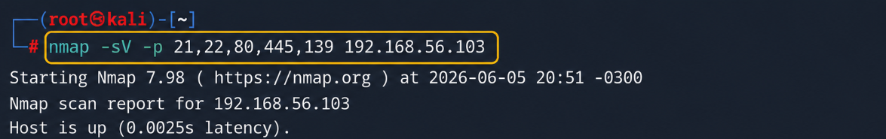

# Dictionary Attack: Exploiting Vulnerable FTP with Medusa


<p align="center">
  
  
  
  
  
  
</p>


> **Laboratório didático de Segurança da Informação** demonstrando, em ambiente isolado e autorizado, como funciona um ataque de força bruta do tipo **Dictionary Attack** contra um serviço FTP vulnerável.

---

## 📌 Descrição do Projeto

Este repositório apresenta um laboratório prático desenvolvido como projeto pessoal para demonstrar conhecimentos em segurança ofensiva, enumeração de serviços e ataques de dicionário.
O objetivo foi demonstrar, de forma controlada, como um atacante pode utilizar listas de usuários e senhas para testar combinações contra um serviço exposto.

A demonstração foi realizada com:

- **Kali Linux** como máquina atacante;
- **Metasploitable 2** como máquina alvo vulnerável;
- **Nmap** para enumeração de portas e serviços;
- **Medusa** para execução do ataque de dicionário contra o serviço **FTP**.

---

## 🛠️ Ambiente e Ferramentas Utilizadas

### 🖥️ Ambiente

---

| Imagem | Recurso | Descrição |
|:---:|---|---|
|  | **Virtualização** | Oracle VirtualBox utilizado para criar, executar e isolar as máquinas virtuais do laboratório de forma segura. |
|  | **Máquina atacante** | Kali Linux utilizado como ambiente ofensivo para execução das ferramentas de enumeração, criação de wordlists e ataque. |
|  | **Máquina alvo** | Metasploitable 2 utilizado como sistema vulnerável propositalmente configurado para práticas de segurança em laboratório. |
|  | **Rede** | Rede virtual isolada entre as VMs, permitindo a comunicação entre atacante e alvo sem exposição externa. |
|  | **Serviço explorado** | Serviço FTP identificado durante a fase de enumeração e utilizado como ponto de análise no ataque de dicionário. |
|  | **Porta explorada** | Porta **21/tcp**, associada ao protocolo FTP, selecionada para demonstrar tentativas automatizadas de autenticação. |

### ⚙️ Ferramentas

---

| Imagem | Ferramenta | Finalidade |
|:---:|---|---|
|  | **Nmap** | Ferramenta utilizada para identificar portas abertas, serviços ativos e versões em execução no alvo Metasploitable 2. |
|  | **Medusa** | Ferramenta utilizada para automatizar testes de autenticação com usuários e senhas definidos em wordlists customizadas. |
|  | **Bash** | Shell utilizado para criar, organizar e manipular os arquivos de usuários e senhas empregados durante o laboratório. |
|  | **Pentest** | Abordagem prática aplicada para simular um teste de intrusão autorizado, controlado e focado em aprendizado técnico. |

---

## 🚀 Guia de Execução Passo a Passo

---

## 1. 🔎 Enumeração com Nmap

A primeira etapa do laboratório foi realizar o reconhecimento do alvo com o objetivo de identificar portas abertas, serviços ativos e versões em execução.

<table>
  <tr>
    <th width="100%">Comando Executado</th>
  </tr>
  <tr>
    <td width="100%" align="center">
      
    </td>
  </tr>
</table>

### Explicação dos parâmetros

| Parâmetro | Função | Relevância no laboratório |
|---|---|---|
| `-sV` | Detecta as versões dos serviços encontrados durante a varredura. | Permite identificar tecnologias específicas em execução, como `vsftpd 2.3.4`, auxiliando na análise da superfície de ataque. |
| `-p` | Define manualmente quais portas serão analisadas pelo Nmap. | Direciona a enumeração para portas relevantes, tornando a varredura mais objetiva e alinhada ao escopo do laboratório. |
| `21,22,80,445,139` | Lista as portas selecionadas para a varredura. | Inclui serviços comuns como FTP, SSH, HTTP e SMB, permitindo comparar diferentes pontos de exposição no alvo. |
| `192.168.56.103` | Define o endereço IP da máquina alvo Metasploitable 2. | Representa o host vulnerável utilizado no ambiente controlado para a etapa de reconhecimento. |

### Evidência visual



### Resultado identificado

```text
PORT     STATE  SERVICE      VERSION
21/tcp   open   ftp          vsftpd 2.3.4
22/tcp   open   ssh          OpenSSH 4.7p1 Debian 8ubuntu1 (protocol 2.0)
80/tcp   open   http         Apache httpd 2.2.8 ((Ubuntu) DAV/2)
139/tcp  open   netbios-ssn  Samba smbd 3.X - 4.X (workgroup: WORKGROUP)
445/tcp  open   netbios-ssn  Samba smbd 3.X - 4.X (workgroup: WORKGROUP)
```

### Análise da enumeração

O serviço escolhido para o laboratório foi o **FTP**, identificado na porta `21/tcp`.

| Porta | Serviço | Versão | Observação |
|---|---|---|---|
| `21/tcp` | FTP | `vsftpd 2.3.4` | Serviço selecionado para o teste de dicionário |
| `22/tcp` | SSH | `OpenSSH 4.7p1` | Serviço remoto identificado |
| `80/tcp` | HTTP | `Apache 2.2.8` | Servidor web ativo |
| `139/tcp` | NetBIOS/SMB | `Samba smbd 3.X - 4.X` | Serviço de compartilhamento |
| `445/tcp` | SMB | `Samba smbd 3.X - 4.X` | Serviço de compartilhamento |

> A enumeração é uma etapa crítica em testes de intrusão, pois permite entender quais superfícies de ataque estão expostas antes de qualquer tentativa de exploração.

---

## 2. 📚 Criação das Wordlists

Após identificar o serviço FTP, foram criadas duas listas simples para fins didáticos:

- uma lista contendo possíveis **usuários**;
- uma lista contendo possíveis **senhas**.

### Criação do arquivo de usuários

```bash
echo -e "user\nmsfadmin\nadmin\nroot" > users.txt
```

### Criação do arquivo de senhas

```bash
echo -e "123456\npassword\nqwerty\nmsfadmin" > pass.txt
```

### Evidência visual


### Estrutura dos arquivos

#### `users.txt`

```text
user
msfadmin
admin
root
```

#### `pass.txt`

```text
123456
password
qwerty
msfadmin
```

### Observação técnica

O operador `>` foi utilizado para redirecionar a saída do comando `echo` para arquivos `.txt`.

| Arquivo | Conteúdo | Função |
|---|---|---|
| `users.txt` | Possíveis nomes de usuário | Lista usada pelo Medusa com `-U` |
| `pass.txt` | Possíveis senhas | Lista usada pelo Medusa com `-P` |

> Em um ambiente real de defesa, listas de senhas comuns como `123456`, `password` e `qwerty` devem ser bloqueadas por políticas de senha.

---

## 3. ⚡ Ataque de Dicionário com Medusa

Com o serviço FTP identificado e as wordlists criadas, foi executado o ataque de dicionário utilizando o **Medusa**.

### Comando executado

```bash
medusa -h 192.168.56.103 -U users.txt -P pass.txt -M ftp -t 6
```

### Explicação dos parâmetros

| Parâmetro | Função |
|---|---|
| `-h 192.168.56.103` | Define o host alvo |
| `-U users.txt` | Define a lista de usuários |
| `-P pass.txt` | Define a lista de senhas |
| `-M ftp` | Define o módulo/protocolo de ataque como FTP |
| `-t 6` | Define o número de tarefas paralelas |

### Evidência visual


### Resultado obtido

Durante a execução, o Medusa testou as combinações entre os usuários e senhas informados.  
O laboratório resultou na identificação de uma credencial válida:

```text
ACCOUNT FOUND: [ftp] Host: 192.168.56.103 User: msfadmin Password: msfadmin [SUCCESS]
```

### Credencial encontrada no laboratório

| Serviço | Host | Usuário | Senha | Status |
|---|---|---|---|---|
| FTP | `192.168.56.103` | `msfadmin` | `msfadmin` | `SUCCESS` |

> A credencial encontrada pertence ao ambiente vulnerável Metasploitable 2 e foi utilizada apenas para demonstração em laboratório.

---

## 🔍 Interpretação dos Resultados

O teste demonstrou que o serviço FTP aceitava autenticação com uma credencial fraca e previsível.

A vulnerabilidade observada não está apenas na existência do serviço FTP, mas principalmente na combinação de fatores:

1. serviço exposto na rede;
2. credenciais fracas ou padrão;
3. ausência de bloqueio por tentativas repetidas;
4. ausência de monitoramento ativo;
5. ambiente propositalmente vulnerável para estudo.

---

## 🛡️ Como Mitigar esse Tipo de Ataque

A defesa contra ataques de dicionário envolve uma combinação de políticas, controles técnicos e monitoramento.

| Medida | Descrição |
|---|---|
| Política de senhas fortes | Impedir senhas comuns, curtas ou previsíveis |
| Bloqueio temporário | Aplicar bloqueio após múltiplas tentativas inválidas |
| Rate limiting | Reduzir a velocidade de tentativas por IP ou usuário |
| MFA | Exigir múltiplo fator de autenticação quando aplicável |
| Monitoramento de logs | Identificar padrões de tentativa de login repetida |
| Fail2ban/IDS | Automatizar bloqueios e alertas de comportamento suspeito |
| Desativar serviços desnecessários | Remover FTP caso não seja essencial |
| Preferir SFTP/FTPS | Utilizar protocolos mais seguros para transferência de arquivos |
| Gestão de credenciais padrão | Alterar ou remover usuários e senhas padrão |
| Segmentação de rede | Restringir acesso ao serviço somente a redes confiáveis |

### Exemplo de indicadores defensivos

Administradores podem investigar eventos como:

```text
Múltiplas falhas de login no mesmo serviço
Diversas tentativas vindas do mesmo IP
Tentativas sequenciais contra diferentes usuários
Uso de senhas comuns ou padrões conhecidos
Autenticação bem-sucedida após várias falhas
```

> O objetivo de entender a técnica ofensiva é melhorar a capacidade de prevenção, detecção e resposta.

---

## 📁 Organização Recomendada do Repositório

```text
medusa-dictionary-attack-lab/
├── README.md
├── docs/
│   └── images/
│       ├── 01-nmap-enumeration.png
│       ├── 02-wordlists.png
│       └── 03-medusa-success.png
├── wordlists/
│   ├── users.txt
│   └── pass.txt
└── notes/
    └── mitigations.md
```

### Sugestão para adicionar os prints

Renomeie as imagens do laboratório e salve-as em:

```text
docs/images/
```

Mapeamento sugerido:

| Print | Nome recomendado |
|---|---|
| Print da enumeração Nmap | `01-nmap-enumeration.png` |
| Print da criação das wordlists | `02-wordlists.png` |
| Print do Medusa com sucesso | `03-medusa-success.png` |

---

## 🧠 Principais Aprendizados

Ao final do laboratório, os participantes puderam compreender:

- como identificar serviços expostos em uma máquina alvo;
- como interpretar versões e portas retornadas pelo Nmap;
- como funcionam arquivos de dicionário para usuários e senhas;
- como ferramentas automatizadas testam combinações de credenciais;
- por que senhas fracas continuam sendo um risco crítico;
- quais controles reduzem o risco de ataques de força bruta.

---

## ✅ Conclusão

Este laboratório demonstrou, de forma prática e controlada, como um ataque de dicionário pode comprometer um serviço quando há credenciais fracas ou previsíveis.

A atividade reforça a importância de boas práticas defensivas, como:

- criação de senhas robustas;
- remoção de credenciais padrão;
- limitação de tentativas de autenticação;
- monitoramento de logs;
- segmentação de rede;
- redução da superfície de ataque.

> Segurança ofensiva, quando praticada de forma ética e autorizada, é uma ferramenta essencial para fortalecer ambientes reais.

---

## 👨‍💻 Autor/Instrutor

**Alessandro Aparecido Estevam**  
Projeto desenvolvido para fins educacionais e composição de portfólio em Segurança da Informação.

- GitHub: `https://github.com/seu-usuario`
- LinkedIn: `https://www.linkedin.com/in/seu-perfil`

---

## 📜 Licença

Este projeto é disponibilizado para fins educacionais.  
Use, adapte e compartilhe com responsabilidade.

```text
Uso permitido: estudo, laboratório, documentação acadêmica e portfólio.
Uso proibido: execução contra sistemas sem autorização.
```
