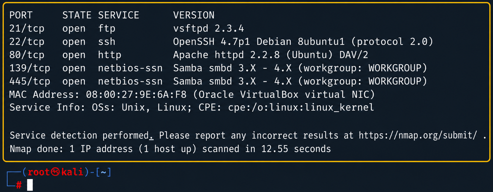
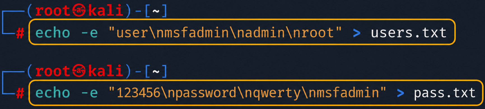
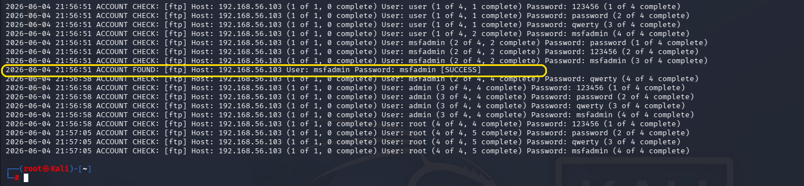

# Dictionary Attack: Exploiting Vulnerable FTP with Medusa


<p align="center">
  
  
  
  
  
  
</p>


> **Information Security lab** demonstrating, in an isolated and authorized environment, how a **Dictionary Attack** works against a vulnerable FTP service.

---

## 📌 Project Description

This repository presents a practical lab developed as a personal project to demonstrate knowledge in offensive security, service enumeration, and dictionary attacks.  
The goal was to demonstrate, in a controlled way, how an attacker can use username and password lists to test authentication combinations against an exposed service.

The demonstration was performed with:

- **Kali Linux** as the attacking machine;
- **Metasploitable 2** as the vulnerable target machine;
- **Nmap** for port and service enumeration;
- **Medusa** to execute the dictionary attack against the **FTP** service.

---

## 🛠️ Environment and Tools Used

### 🖥️ Environment

---

| Image | Resource | Description |
|:---:|---|---|
|  | **Virtualization** | Oracle VirtualBox used to create, run, and isolate the lab virtual machines safely. |
|  | **Attacking machine** | Kali Linux used as the offensive environment for enumeration, wordlist creation, and attack execution. |
|  | **Target machine** | Metasploitable 2 used as an intentionally vulnerable system for security practice in a lab environment. |
|  | **Network** | Isolated virtual network between the VMs, allowing communication between attacker and target without external exposure. |
|  | **Exploited service** | FTP service identified during enumeration and used as the analysis point for the dictionary attack. |
|  | **Exploited port** | Port **21/tcp**, associated with the FTP protocol, selected to demonstrate automated authentication attempts. |

### ⚙️ Tools

---

| Image | Tool | Purpose |
|:---:|---|---|
|  | **Nmap** | Tool used to identify open ports, active services, and running versions on the Metasploitable 2 target. |
|  | **Medusa** | Tool used to automate authentication tests with usernames and passwords defined in custom wordlists. |
|  | **Bash** | Shell used to create, organize, and manipulate the username and password files used during the lab. |
|  | **Pentest** | Practical approach used to simulate an authorized, controlled intrusion test focused on technical learning. |

---

## 📁 Repository Structure

The project structure was organized to separate the main documentation, visual evidence, and wordlists used in the lab.

```text
medusa-dictionary-attack-lab/
├── README.md
├── docs/
│   └── images/
│       ├── 01-nmap-enumeration.png
│       ├── 02-nmap-enumeration-result.png
│       ├── 03-wordlist.png
│       ├── 04-medusa-command.png
│       └── 05-medusa-command-result.png
└── wordlists/
    ├── users.txt
    └── pass.txt
```

---

## 🚀 Step-by-Step Execution Guide

---

## 1. 🔎 Enumeration with Nmap

The first stage of the lab was to perform target reconnaissance in order to identify open ports, active services, and running versions.

---

<table>
  <tr>
  </tr>
  <tr>
    <td width="100%" align="center">
      
    </td>
  </tr>
</table>

### 🧩 Parameter Explanation

---

| Parameter | Function | Relevance in the lab |
|---|---|---|
| `-sV` | Detects the versions of services found during the scan. | Allows identification of specific technologies running on the target, such as `vsftpd 2.3.4`, helping analyze the attack surface. |
| `-p` | Manually defines which ports will be scanned by Nmap. | Directs enumeration to relevant ports, making the scan more objective and aligned with the lab scope. |
| `21,22,80,445,139` | Lists the selected ports for the scan. | Includes common services such as FTP, SSH, HTTP, and SMB, allowing comparison of different exposure points on the target. |
| `192.168.56.103` | Defines the IP address of the Metasploitable 2 target machine. | Represents the vulnerable host used in the controlled environment for the reconnaissance stage. |

### 📊 Identified Result

---

<table>
  <tr>
  </tr>
  <tr>
    <td width="100%" align="center">
      
    </td>
  </tr>
</table>

### 🧠 Enumeration Analysis

---

The service selected for the lab was **FTP**, identified on port `21/tcp`.

<table width="100%">
  <tr>
    <th width="12%">Port</th>
    <th width="13%">Service</th>
    <th width="25%">Version</th>
    <th width="50%">Observation</th>
  </tr>
  <tr>
    <td><code>21/tcp</code></td>
    <td><strong>FTP</strong></td>
    <td><code>vsftpd 2.3.4</code></td>
    <td>Service selected for the dictionary attack test with Medusa.</td>
  </tr>
  <tr>
    <td><code>22/tcp</code></td>
    <td><strong>SSH</strong></td>
    <td><code>OpenSSH 4.7p1</code></td>
    <td>Remote access service identified during enumeration.</td>
  </tr>
  <tr>
    <td><code>80/tcp</code></td>
    <td><strong>HTTP</strong></td>
    <td><code>Apache httpd 2.2.8</code></td>
    <td>Active web server on the target, indicating HTTP application exposure.</td>
  </tr>
  <tr>
    <td><code>139/tcp</code></td>
    <td><strong>NetBIOS/SMB</strong></td>
    <td><code>Samba smbd 3.X - 4.X</code></td>
    <td>Service related to sharing and communication in Windows/Linux networks.</td>
  </tr>
  <tr>
    <td><code>445/tcp</code></td>
    <td><strong>SMB</strong></td>
    <td><code>Samba smbd 3.X - 4.X</code></td>
    <td>File-sharing service exposed on the target machine.</td>
  </tr>
</table>

> Enumeration is a critical stage in penetration testing because it helps identify which attack surfaces are exposed before any exploitation attempt.

---

## 2. 📚 Wordlist Creation

After identifying the FTP service, two simple lists were created for educational purposes:

- a list containing possible **usernames**;
- a list containing possible **passwords**.

---

<table>
  <tr>
  </tr>
  <tr>
    <td width="100%" align="center">
      
    </td>
  </tr>
</table>

### 📁 File Structure

#### `users.txt`

```text
user
msfadmin
admin
root
```

#### `pass.txt`

```text
123456
password
qwerty
msfadmin
```

### 📝 Technical Note

The `>` operator was used to redirect the output of the `echo` command into `.txt` files.

---

<table width="100%">
  <tr>
    <th width="18%">File</th>
    <th width="32%">Content</th>
    <th width="50%">Purpose</th>
  </tr>
  <tr>
    <td><code>users.txt</code></td>
    <td>Possible usernames</td>
    <td>List used by Medusa with the <code>-U</code> parameter to test usernames during the dictionary attack.</td>
  </tr>
  <tr>
    <td><code>pass.txt</code></td>
    <td>Possible passwords</td>
    <td>List used by Medusa with the <code>-P</code> parameter to test passwords associated with the provided users.</td>
  </tr>
</table>

> In a real defensive environment, common passwords such as `123456`, `password`, and `qwerty` should be blocked by password policies.

---

## 3. ⚡ Dictionary Attack with Medusa

With the FTP service identified and the wordlists created, the dictionary attack was executed using **Medusa**.

---

<table>
  <tr>
  </tr>
  <tr>
    <td width="100%" align="center">
      
    </td>
  </tr>
</table>

### 🧩 Parameter Explanation

---

<table width="100%">
  <tr>
    <th width="20%">Parameter</th>
    <th width="35%">Function</th>
    <th width="45%">Relevance in the lab</th>
  </tr>
  <tr>
    <td style="white-space: nowrap;"><code>-h 192.168.56.103</code></td>
    <td>Defines the target host to be tested by the tool.</td>
    <td>Directs the attack to the Metasploitable 2 machine previously identified during enumeration.</td>
  </tr>
  <tr>
    <td style="white-space: nowrap;"><code>-U users.txt</code></td>
    <td>Defines the file containing the username list.</td>
    <td>Allows Medusa to test the usernames created in the lab custom wordlist.</td>
  </tr>
  <tr>
    <td style="white-space: nowrap;"><code>-P pass.txt</code></td>
    <td>Defines the file containing the password list.</td>
    <td>Allows testing common password combinations against the users defined in the <code>users.txt</code> file.</td>
  </tr>
  <tr>
    <td style="white-space: nowrap;"><code>-M ftp</code></td>
    <td>Defines the module/protocol used in the attack.</td>
    <td>Specifies that the test will be performed against the FTP service exposed on port <code>21/tcp</code>.</td>
  </tr>
  <tr>
    <td style="white-space: nowrap;"><code>-t 6</code></td>
    <td>Defines the number of parallel tasks executed by Medusa.</td>
    <td>Improves test efficiency by allowing multiple simultaneous attempts within the controlled environment.</td>
  </tr>
</table>

### 📊 Result Obtained

During execution, Medusa tested combinations between the provided usernames and passwords.  
The lab resulted in the identification of a valid credential:

---

<table>
  <tr>
  </tr>
  <tr>
    <td width="100%" align="center">
      
    </td>
  </tr>
</table>

### 🔐 Credential Found in the Lab

---

<table width="100%">
  <tr>
    <th width="20%" align="center">&nbsp;Analyzed&nbsp;service&nbsp;</th>
    <th width="20%" align="center">&nbsp;Target&nbsp;address&nbsp;</th>
    <th width="20%" align="center">&nbsp;Username&nbsp;credential&nbsp;</th>
    <th width="20%" align="center">&nbsp;Matching&nbsp;password&nbsp;</th>
    <th width="20%" align="center">&nbsp;Final&nbsp;status&nbsp;</th>
  </tr>
  <tr>
    <td width="20%" align="center"><strong>FTP / Port 21</strong></td>
    <td width="20%" align="center"><code>192.168.56.103</code></td>
    <td width="20%" align="center"><code>msfadmin</code></td>
    <td width="20%" align="center"><code>msfadmin</code></td>
    <td width="20%" align="center"><strong>SUCCESS</strong></td>
  </tr>
</table>

> The discovered credential belongs to the vulnerable Metasploitable 2 environment and was used only for lab demonstration purposes.

---

## 🛡️ How to Mitigate This Type of Attack

Defending against dictionary attacks involves a combination of policies, technical controls, and continuous monitoring.

---

<table width="100%">
  <tr>
    <th width="8%" align="center">Icon</th>
    <th width="27%" align="center">Measure</th>
    <th width="65%" align="center">Description</th>
  </tr>
  <tr>
    <td align="center">
      
    </td>
    <td><strong>Strong password policy</strong></td>
    <td>Prevent common, short, or predictable passwords by requiring stronger combinations resistant to dictionary attacks.</td>
  </tr>
  <tr>
    <td align="center">
      
    </td>
    <td><strong>Temporary lockout</strong></td>
    <td>Apply account lockout or temporary delay after multiple invalid authentication attempts.</td>
  </tr>
  <tr>
    <td align="center">
      
    </td>
    <td><strong>Rate limiting</strong></td>
    <td>Reduce the speed of attempts per IP, user, or service, making large-scale automated attacks harder.</td>
  </tr>
  <tr>
    <td align="center">
      
    </td>
    <td><strong>MFA</strong></td>
    <td>Require multi-factor authentication when applicable, reducing the impact of a compromised password.</td>
  </tr>
  <tr>
    <td align="center">
      
    </td>
    <td><strong>Log monitoring</strong></td>
    <td>Identify repeated login attempt patterns, suspicious authentications, and access outside expected behavior.</td>
  </tr>
  <tr>
    <td align="center">
      
    </td>
    <td><strong>Fail2ban / IDS</strong></td>
    <td>Automate blocks and alerts based on suspicious behavior, such as multiple authentication failures.</td>
  </tr>
  <tr>
    <td align="center">
      
    </td>
    <td><strong>Disable unnecessary services</strong></td>
    <td>Remove or disable services that are not essential, reducing the available attack surface.</td>
  </tr>
  <tr>
    <td align="center">
      
    </td>
    <td><strong>Prefer SFTP / FTPS</strong></td>
    <td>Use more secure file transfer protocols, avoiding unnecessary exposure of legacy services.</td>
  </tr>
  <tr>
    <td align="center">
      
    </td>
    <td><strong>Default credential management</strong></td>
    <td>Change or remove default usernames and passwords, especially on newly installed systems or test environments.</td>
  </tr>
  <tr>
    <td align="center">
      
    </td>
    <td><strong>Network segmentation</strong></td>
    <td>Restrict access to the service only to trusted networks, limiting direct exposure of FTP.</td>
  </tr>
</table>

---

## ✅ Conclusion

This lab demonstrated, in a practical and controlled way, how a dictionary attack can compromise a service when weak or predictable credentials are present.

The activity reinforces the importance of defensive best practices applied in real environments, especially when authentication services are exposed on the network.

<table width="100%">
  <tr>
    <th width="8%" align="center">Visual</th>
    <th width="27%" align="center">Defensive best practice</th>
    <th width="65%" align="center">Importance for mitigation</th>
  </tr>
  <tr>
    <td align="center">
      
    </td>
    <td><strong>Strong passwords</strong></td>
    <td>Reduce the chance of success in attacks based on common, predictable, or reused combinations.</td>
  </tr>
  <tr>
    <td align="center">
      
    </td>
    <td><strong>Removal of default credentials</strong></td>
    <td>Prevents known usernames and passwords from being exploited on newly installed or poorly configured systems.</td>
  </tr>
  <tr>
    <td align="center">
      
    </td>
    <td><strong>Attempt limitation</strong></td>
    <td>Makes automated tests harder by applying lockouts, delays, or restrictions after multiple authentication failures.</td>
  </tr>
  <tr>
    <td align="center">
      
    </td>
    <td><strong>Log monitoring</strong></td>
    <td>Helps identify suspicious patterns, such as repeated attempts, failed authentications, and unusual access.</td>
  </tr>
  <tr>
    <td align="center">
      
    </td>
    <td><strong>Network segmentation</strong></td>
    <td>Restricts access to services only to trusted networks, reducing direct exposure of the environment.</td>
  </tr>
  <tr>
    <td align="center">
      
    </td>
    <td><strong>Attack surface reduction</strong></td>
    <td>Minimizes risk by disabling unnecessary services and keeping only essential resources exposed.</td>
  </tr>
</table>

> Offensive security, when practiced ethically and with authorization, is an essential tool for strengthening real environments.

---

## 👨‍💻 Author

<div align="left">
  
  &nbsp;&nbsp;
  
</div>

---
